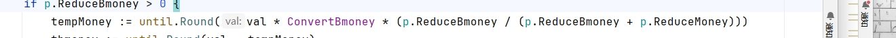

# 游戏平台支付相关

## 数据库表

定一个游戏表 厂商 ---> 游戏list,定义id对应他们的游戏，玩他们一局，调用我们接口写入
先bmoney 再amoney
流水表 每一局赢了多少钱，多少比例转换的bmoney， 新建一张平台流水，加入局id，游戏id，倍数，比例（我们没有的）,同时新增我们的flwo表中
money是Amoney bmoney是Bmoney

退钱：下注失败从哪扣退还到哪

赢钱比例0.1
amoney=until.round(计算比例)

bmoney=val- amoney

### 厂商游戏表 gate_supplier_game

| 字段名         | 类型     | 说明              |
|-------------|--------|-----------------|
| id          | int    | 游戏id            |
| supplier_id | int    | 游戏厂商id  (对应厂商表) |
| game_name   | string | 游戏名称            |
| status      | int    | 状态 1-正常 2-删除    |
| game_desc   | string | 游戏描述            |
| create_time | int    | 创建时间            |
| update_time | int    | 更新时间            |
| delete_time | int    | 删除时间            |

### 游戏流水表 gate_flow

| 字段名           | 类型      | 说明            |
|---------------|---------|---------------|
| id            | int     | 流水id          |
| flow_id       | string  | 第三方流水id(全局唯一) |
| uid           | int     | 用户id          |
| game_id       | string  | 游戏id          |
| round_id      | string  | 局id           |
| type          | int     | 流水类型          |
| currency_type | int     | 货币类型          |
| alter_value   | float64 | 改变值  +-       |
| current_value | float64 | 当前值           |
| create_time   | int     | 创建时间          |

status 1已退款 2已赢钱

# 下注金额 单位分 需转换为元，返回一个我们的事务id（雪花时间戳或者拼都行），并且返回他的下注，退款金额
下注id需校验是否重复，重复返回错误码